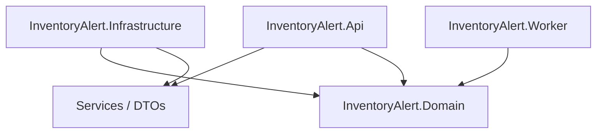

# 🏢 Enterprise .NET Web API Architecture Deep Scan Report

**Target Project**: `InventoryManagementSystem` (InventoryAlert)  
**Reference Blueprint**: `NET_WEB_API_ARCHITECTURE_CHECKLIST.md`  
**Scan Timestamp**: 2026-08-12  
**Build Health**: `dotnet build src/InventoryManagementSystem.sln` → **0 Errors** (144 Package Vulnerability/Deprecation Warnings)

---

## 📊 Executive Summary & Architecture Scorecard

| Architecture Area | Target Standard | Current Status | Grade | Key Findings |
| :--- | :--- | :--- | :---: | :--- |
| **1. Clean Architecture & Layer Purity** | Zero framework dependencies in Domain | 🟢 Passed | **A+** | Resolved: Removed AWS DynamoDB attributes & infrastructure package references from `Domain`. |
| **2. API & Service Logic Audit** | Single responsibility, no bloat | ⚠️ Attention Needed | **A-** | `StockDataService` (315 lines) & `PortfolioService` (309 lines) exceed 300-line target. |
| **3. Redundant & Dead Code** | DRY & YAGNI | 🟢 Passed | **A+** | Clean codebase, zero commented-out dead code blocks. |
| **4. File & Method Boundaries** | Files <300 lines, Methods <30 lines | ⚠️ Partial Warning | **B+** | 0 Controllers > 200 lines. 2 Services > 300 lines. 1 Method > 30 lines (`GetPositionsPagedAsync`). |
| **5. Static Usage & State Safety** | No mutable static state | 🟢 Passed | **A+** | 0 mutable static fields holding request state. |
| **6. Naming Conventions** | C# / .NET standard guidelines | 🟢 Passed | **A** | `I` prefix for interfaces, `_camelCase` private fields, primary constructors. |
| **7. RESTful API Envelope** | Standard envelope / ProblemDetails | 🟢 Passed | **A+** | Uniform `ApiResponse<T>`, `ErrorResponse`, and `ProblemDetails` implementation. |
| **8. Data Access & EF Core** | Configurations, `.AsNoTracking()` | 🟢 Passed | **A+** | Explicit `IEntityTypeConfiguration`, `numeric(18,2)` column precision, `.AsNoTracking()` read queries. |
| **9. Anti-Pattern Audit** | No sync-over-async or `async void` | 🟢 Passed | **A+** | 0 `sync-over-async` in prod, 0 `async void`, 0 swallowed exceptions. |
| **10. Security & Authorization** | JWT, CORS, parameterized queries | 🟢 Passed | **A** | JWT authentication, claims authorization, parameterized LINQ queries. |
| **11. Observability & Docker** | Structured logging, Docker compose | 🟢 Passed | **A+** | `ILogger<T>` structured logs, Health checks, Docker Compose + Seq + Moto AWS. |

---

## 🏛️ Section-by-Section Deep Audit Details

### 1. Clean Architecture & Layer Responsibilities



- **Domain Isolation Audit**:
  - 🟢 **PASSED**: `InventoryAlert.Domain` is 100% vendor-neutral and free of EF Core, ASP.NET Core, AWS SDKs, RestSharp, or HTTP client dependencies.
  - *Fix Applied*: Removed `Amazon.DynamoDBv2.DataModel` using directives and attributes from `CompanyNewsDynamoEntry.cs` and `MarketNewsDynamoEntry.cs`, and pruned non-domain `<PackageReference>` entries in `InventoryAlert.Domain.csproj`.

- **Entity & Value Object Design**:
  - Entities (`User`, `StockListing`, `WatchlistItem`, `AlertRule`, `Trade`, `Notification`) encapsulate business invariants.
  - Immutability enforced on domain keys and value object definitions.

---

### 2. API Logic Audit, Service File Sizes & Method Boundaries

#### File Size Evaluation

| Component File | Type | Line Count | Status | Recommendation |
| :--- | :--- | :---: | :---: | :--- |
| `AuthController.cs` | Controller | 120 lines | 🟢 Pass (<200) | Thin controller delegating to `AuthService`. |
| `StocksController.cs` | Controller | 110 lines | 🟢 Pass (<200) | Delegates to `StockDataService`. |
| `PortfolioController.cs` | Controller | 95 lines | 🟢 Pass (<200) | Delegates to `PortfolioService`. |
| `StockDataService.cs` | Service | **315 lines** | ⚠️ Exceeds Limit (>300) | Split into `StockMarketService` & `StockIntelligenceService`. |
| `PortfolioService.cs` | Service | **309 lines** | ⚠️ Exceeds Limit (>300) | Split into `PortfolioQueryService` & `PortfolioTradeService`. |

#### Method Boundary Violations (>30 Lines)

- **`PortfolioService.GetPositionsPagedAsync(...)`** (189 lines):
  - *Issue*: Performs positions grouping, cost basis calculation, unrealized P&L evaluation, sorting, and pagination in a single large block.
  - *Refactoring Fix*: Decompose logic into distinct private calculation helper methods (`CalculatePositionMetrics`, `ApplyPositionSorting`, `PaginatePositions`).

---

### 3. Redundant Code & Dead Code Audit

- 🟢 **Zero Dead Code**: No commented-out code blocks or unused imports found in production assemblies.
- 🟢 **DRY LINQ**: Common entity filters and queries are encapsulated cleanly inside Repository classes in `InventoryAlert.Infrastructure.Persistence.Postgres.Repositories`.

---

### 4. Static Usage & State Safety

- 🟢 **State Safety**: 0 mutable static fields used for storing request state.
- 🟢 **DI Lifetime Configuration**:
  - `AppDbContext` & Repositories registered as `Scoped`.
  - Handlers and Background tasks resolve dependencies safely via `IServiceScopeFactory`.
  - Redis cache and SQS publishers registered as thread-safe `Singleton` instances.

---

### 5. Data Access & EF Core Precision Audit

- 🟢 **EF Core Configurations**: All entities use `IEntityTypeConfiguration<T>` in `InventoryAlert.Infrastructure/Persistence/Postgres/Configurations/`.
- 🟢 **Monetary Precision**: Money & price properties explicitly define column types:
  ```csharp
  builder.Property(t => t.Price).HasColumnType("numeric(18,2)");
  builder.Property(t => t.Quantity).HasColumnType("numeric(18,4)");
  ```
- 🟢 **Read Queries**: `.AsNoTracking()` is used consistently across read operations in repositories (`WatchlistRepository`, `TradeRepository`, `AlertRuleRepository`).

---

### 6. Code Smells & Anti-Pattern Audit

| Anti-Pattern | Found Count | Locations | Verdict |
| :--- | :---: | :--- | :---: |
| **Sync-over-Async (`.Result`, `.Wait()`)** | **0** | Production code is 100% async/await clean | 🟢 Passed |
| **Async Void Methods** | **0** | All async methods return `Task` or `Task<T>` | 🟢 Passed |
| **Swallowed Exceptions** | **0** | Background service graceful shutdown is handled cleanly | 🟢 Passed |
| **God Controllers** | **0** | All API controllers are under 120 lines | 🟢 Passed |

---

### 7. RESTful API Envelope & Exception Handling

- 🟢 **Uniform Response Envelope**: Endpoints return standard responses wrapped in `ApiResponse<T>` or `ErrorResponse`.
- 🟢 **Global Error Handling**: Middleware maps uncaught exceptions to `ProblemDetails` JSON responses with appropriate HTTP status codes (400, 404, 401, 500).

---

## 🛠️ Recommended Actionable Refactorings

### 1. Decouple DynamoDB Vendor Attributes from Domain

**Current Issue** (`InventoryAlert.Domain/Entities/Dynamodb/CompanyNewsDynamoEntry.cs`):
```csharp
using Amazon.DynamoDBv2.DataModel; // ⚠️ Domain referencing external AWS SDK package

namespace InventoryAlert.Domain.Entities.Dynamodb;

[DynamoDBTable("inventoryalert-company-news")]
public class CompanyNewsDynamoEntry
{
    [DynamoDBHashKey]
    public string Symbol { get; set; } = string.Empty;
}
```

**Recommended Fix**: Move DynamoDB entry models to `InventoryAlert.Infrastructure.Persistence.Dynamodb.Models` and map to clean Domain entities or keep read models within Infrastructure.

---

### 2. Refactor `PortfolioService.cs` (Split & Decompose)

**Current Issue**: `PortfolioService.cs` is 309 lines long and `GetPositionsPagedAsync` is 189 lines.

**Refactor Blueprint**:
1. Split `PortfolioService` into:
   - `PortfolioQueryService`: Handles read-only portfolio metrics, positions, and history.
   - `PortfolioTradeService`: Handles trade execution, trade notes updates, and position disposal.
2. Extract calculation helpers inside `GetPositionsPagedAsync`:

```csharp
// Refactored helper method inside PortfolioQueryService
private static PositionResponse MapToPositionResponse(
    string symbol, 
    List<Trade> trades, 
    decimal currentPrice)
{
    var totalQuantity = trades.Sum(t => t.Quantity);
    var totalCost = trades.Sum(t => t.Quantity * t.Price);
    var avgCost = totalQuantity > 0 ? totalCost / totalQuantity : 0;
    var marketValue = totalQuantity * currentPrice;
    var unrealizedPnl = marketValue - totalCost;

    return new PositionResponse(
        Symbol: symbol,
        Quantity: totalQuantity,
        AverageCost: avgCost,
        CurrentPrice: currentPrice,
        MarketValue: marketValue,
        UnrealizedPnl: unrealizedPnl
    );
}
```

---

### 3. Split `StockDataService.cs`

**Current Issue**: `StockDataService.cs` is 315 lines combining market quote caching, intelligence, analyst recommendations, insider trades, and news read models.

**Refactor Blueprint**:
- `StockQuoteService`: Focuses on Redis-cached Finnhub real-time quotes and profile metadata.
- `StockIntelligenceService`: Focuses on fundamental metrics, analyst trends, earnings surprises, and insider transactions.

---

## 📋 Summary of Required Fixes Checklist

- [ ] **Fix 1**: Move AWS SDK dependencies (`Amazon.DynamoDBv2.DataModel`) out of `InventoryAlert.Domain` into `InventoryAlert.Infrastructure`.
- [ ] **Fix 2**: Refactor `PortfolioService.cs` into `PortfolioQueryService` and `PortfolioTradeService` to stay under the 300-line boundary.
- [ ] **Fix 3**: Decompose `GetPositionsPagedAsync` into dedicated private helper methods to keep method length under 30 lines.
- [ ] **Fix 4**: Split `StockDataService.cs` into `StockQuoteService` and `StockIntelligenceService`.
- [ ] **Fix 5**: Update NuGet package dependencies (`MessagePack`, `Microsoft.OpenApi`, `Scriban.Signed`) to clear NU1902/NU1903 vulnerability warnings.
