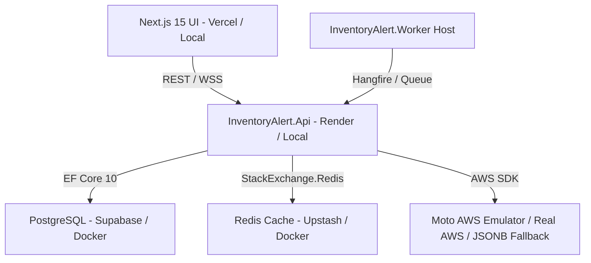

# 📘 Complete InventoryAlert Execution & Deployment Guide

Welcome to the **InventoryAlert (InventoryManagementSystem)** master execution guide. This guide covers **Local Setup**, **AWS-Free Offline Development**, and **$0/Month Free Cloud Hosting** (Render, Supabase, Upstash, Vercel).

---

## 📑 Table of Contents

1. [System Architecture Overview](#-1-system-architecture-overview)
2. [Local Setup Guide (100% Offline / Non-AWS)](#-2-local-setup-guide-100-offline--non-aws)
3. [AWS-Free Zero-Cloud Account Strategy](#-3-aws-free-zero-cloud-account-strategy)
4. [Step-by-Step Free Cloud Deployment Guide ($0/Month)](#-4-step-by-step-free-cloud-deployment-guide-0month)
5. [Testing & Health Verification](#-5-testing--health-verification)

---

## 🏛️ 1. System Architecture Overview



### Component Stack
- **API Host**: .NET 10 ASP.NET Core Minimal API (`InventoryAlert.Api`)
- **Worker Host**: .NET 10 Background Worker with Hangfire (`InventoryAlert.Worker`)
- **Domain & Infrastructure**: Clean Architecture DDD (.NET 10)
- **Frontend UI**: Next.js 15 + React 19 + Tailwind CSS (`InventoryAlert.UI`)
- **Wiki Docs**: Docusaurus 3 Portal (`InventoryAlert.Wiki`)
- **Databases & Cache**: PostgreSQL (EF Core 10), Redis (Cache), AWS SQS/SNS & DynamoDB (or Moto emulator)

---

## 💻 2. Local Setup Guide (100% Offline / Non-AWS)

Follow these steps to run the complete solution locally on your computer **without needing any cloud accounts or credit cards**.

### Prerequisites
- [.NET 10 SDK](https://dotnet.microsoft.com/download/dotnet/10.0)
- [Node.js 20+](https://nodejs.org/) & `npm`
- [Docker Desktop](https://www.docker.com/products/docker-desktop/) (running)

### Step 1: Clone & Spin Up Local Infrastructure (Postgres + Redis + Moto AWS Emulator)

From the project root directory:

```bash
# Navigate to source directory containing docker-compose.yml
cd src

# Start PostgreSQL, Redis, Moto (AWS emulator), and Seq Logger in background
docker-compose up -d
```

This starts:
- **PostgreSQL**: `localhost:5433` (User: `postgres`, Password: `postgres`, DB: `inventory_alert_db`)
- **Redis Cache**: `localhost:6379`
- **Moto AWS Emulator**: `http://localhost:5000` (Emulates AWS SQS, SNS, DynamoDB locally!)
- **Seq Log Server**: `http://localhost:5341`

### Step 2: Apply Database Migrations & Seed Data

```bash
# Run EF Core migrations against local PostgreSQL
dotnet ef database update --project InventoryAlert.Infrastructure --startup-project InventoryAlert.Api
```

### Step 3: Start the Backend API & Background Worker

Open two terminal windows in `src/`:

**Terminal 1 (Web API)**:
```bash
dotnet run --project InventoryAlert.Api
```
- API Swagger UI: `http://localhost:5001/swagger` (or `http://localhost:5000`)
- Health Check: `http://localhost:5001/healthz`

**Terminal 2 (Worker Host)**:
```bash
dotnet run --project InventoryAlert.Worker
```
- Hangfire Dashboard: `http://localhost:5002/hangfire`

### Step 4: Start the Next.js Frontend UI

Open a third terminal window:

```bash
cd src/ui/InventoryAlert.UI
npm install
npm run dev
```
- Open your browser at: `http://localhost:3000`

---

## ⚡ 3. AWS-Free Zero-Cloud Account Strategy

If you want to run or demo this project **without creating an AWS account or using real AWS services**, choose one of these two zero-AWS strategies:

### Strategy A: Moto AWS Emulator (Already Built-in!)

Your code dynamically connects to the **Moto AWS Emulator** running inside Docker via `EndpointUrl`. Zero AWS credentials or credit cards needed!

```json
// appsettings.Development.json
{
  "Aws": {
    "EndpointUrl": "http://localhost:5000",
    "SqsQueueUrl": "http://localhost:5000/123456789012/event-queue",
    "SnsTopicArn": "arn:aws:sns:us-east-1:123456789012:inventory-events"
  }
}
```

### Strategy B: PostgreSQL JSONB Read Models (Zero Extra Services)

Because the project follows **Clean Architecture**, repository interfaces (`ICompanyNewsDynamoRepository`, `IMarketNewsDynamoRepository`) isolate storage implementations. You can save company/market news directly into PostgreSQL `JSONB` columns in your main database without needing DynamoDB or AWS SQS!

---

## 🌐 4. Step-by-Step Free Cloud Deployment Guide ($0/Month)

Deploy your live demo to best-in-class free tier cloud platforms:

```
Vercel (Free)      ──►  Next.js 15 UI
Render (Free)      ──►  .NET 10 API + Worker Container (IPv4)
Neon (Free)        ──►  PostgreSQL DB (Native IPv4 Pooled DB)
Upstash (Free)     ──►  Redis Cache (10,000 req/day)
GitHub Pages (Free)──►  Docusaurus Documentation Portal
```

### 1. Database Setup on Neon PostgreSQL (Recommended for Render IPv4)
Render free tier outbound networking relies on IPv4 addresses. **Neon (`neon.tech`)** is the recommended PostgreSQL host because it provides native IPv4 pooled endpoints:

1. Register at [neon.tech](https://neon.tech) (Free Tier).
2. Create project `inventory-alert-db`. Copy the IPv4 Connection String from the Neon dashboard:
   ```
   Host=ep-xyz-name.us-east-2.aws.neon.tech;Database=neondb;Username=neondb_owner;Password=[YOUR_PASSWORD];SSL Mode=Require;Trust Server Certificate=true
   ```
3. Run EF Core migrations against your Neon database:
   ```bash
   dotnet ef database update --project src/InventoryAlert.Infrastructure --startup-project src/InventoryAlert.Api --connection "Host=ep-xyz-name.us-east-2.aws.neon.tech;Database=neondb;Username=neondb_owner;Password=[YOUR_PASSWORD];SSL Mode=Require;Trust Server Certificate=true"
   ```

### 2. Cache Setup on Upstash (Redis)
1. Register at [upstash.com](https://upstash.com) (Free Tier).
2. Create Redis DB `inventory-alert-redis`. Copy connection string:
   ```
   [ENDPOINT].upstash.io:6379,password=[PASS],ssl=True,abortConnect=False
   ```

### 3. API & Worker Deployment on Render
1. Register at [render.com](https://render.com) and link your GitHub repo.
2. Create a **New Web Service** using the root **Docker** environment.
3. Add Environment Variables:
   - `ASPNETCORE_ENVIRONMENT`: `Production`
   - `Database__DefaultConnection`: *[Your Neon connection string]*
   - `Redis__ConnectionString`: *[Your Upstash connection string]*
   - `Finnhub__ApiKey`: *[Your Finnhub key]*
   - `Jwt__Key`: *[Super_Secret_32_Char_Key]*
4. Deploy! Endpoint will be live at `https://inventory-alert-api.onrender.com`.

### 4. Frontend UI Deployment on Vercel
1. Register at [vercel.com](https://vercel.com).
2. Import repo, set root directory to `src/ui/InventoryAlert.UI`.
3. Add Environment Variables:
   - `NEXT_PUBLIC_API_URL`: `https://inventory-alert-api.onrender.com`
   - `NEXT_PUBLIC_SIGNALR_URL`: `https://inventory-alert-api.onrender.com/hubs/notifications`
4. Deploy! Frontend live at `https://inventory-alert-ui.vercel.app`.

### 5. Prevent Render Free Tier Sleep (UptimeRobot Keep-Alive)
- Render free web services sleep after 15 mins of inactivity.
- Register a free monitor at [uptimerobot.com](https://uptimerobot.com) to HTTP ping `https://inventory-alert-api.onrender.com/healthz` every 10 minutes to keep your demo awake 24/7 at **$0 cost**!

---

## 🧪 5. Testing & Health Verification

### Run Unit Tests
```bash
dotnet test src/test/InventoryAlert.UnitTests/InventoryAlert.UnitTests.csproj
```

### Run Integration Tests
```bash
dotnet test src/test/InventoryAlert.IntegrationTests/InventoryAlert.IntegrationTests.csproj
```

### Health Check Endpoint
Query your live running API:
```bash
curl https://inventory-alert-api.onrender.com/healthz
```
Expected Output: `Healthy`

---

## 📊 6. Admin Dashboards & Monitoring Strategy (Local & Render Production)

When running Moto (emulating SNS, SQS, DynamoDB) or PostgreSQL on Render, Render does not include an AWS CloudWatch console. Use the following deployment strategies to monitor your system:

| Dashboard / Tool | Location & Access | RAM / Resource Cost | Purpose |
| :--- | :--- | :---: | :--- |
| **Hangfire Dashboard** | `https://<your-render-url>/hangfire` | **$0** (Built into API process) | Monitor background job queues, execution logs, retries, and scheduled jobs. |
| **Neon Console (Table/SQL)** | [console.neon.tech](https://console.neon.tech) | **$0** (Hosted by Neon) | Visually inspect relational tables and `JSONB` news/payload read models. |
| **DynamoDB Admin UI** | Local CLI or 2nd Render Web Service | **$0** (Local CLI) | Web GUI to scan, query, insert, and edit DynamoDB items & tables. |
| **Render Streaming Logs** | Render Console → Service → Logs | **$0** (Built into Render) | Stream live `stdout`/`stderr` logs from API & Worker processes. |

---

### 🔍 How to Monitor DynamoDB in Detail

#### Option A: Run `dynamodb-admin` Locally via API Proxy (Recommended — $0 RAM Overhead)
Since Render free tier containers only expose port `8080` publicly, the API automatically reverse-proxies requests hitting `/aws/*` to Moto on internal port `5000`.

Run `dynamodb-admin` on your computer and point it to your live Render API proxy endpoint:
```bash
DYNAMO_ENDPOINT=https://inventory-alert-api.onrender.com/aws npx dynamodb-admin
```
Open `http://localhost:8001` in your local browser to query, scan, and manage DynamoDB tables hosted inside your Render container.

#### Option B: Deploy `dynamodb-admin` as a 2nd Render Container
Deploy a new Web Service on Render using image `aaronshaf/dynamodb-admin:latest` with env:
- `DYNAMO_ENDPOINT`: `http://<your-api-render-service-name>:5000`
- `AWS_REGION`: `us-east-1`
- `AWS_ACCESS_KEY_ID`: `test`
- `AWS_SECRET_ACCESS_KEY`: `test`

#### Option C: Strategy B (Neon PostgreSQL Native JSONB Querying)
If using PostgreSQL for read models instead of DynamoDB, navigate to [console.neon.tech](https://console.neon.tech) → **SQL Editor** and run JSONB queries directly:
```sql
-- Query JSONB attributes from CompanyNews
SELECT id, symbol, payload->>'headline' AS headline, published_at 
FROM "CompanyNews" 
ORDER BY published_at DESC LIMIT 20;
```

