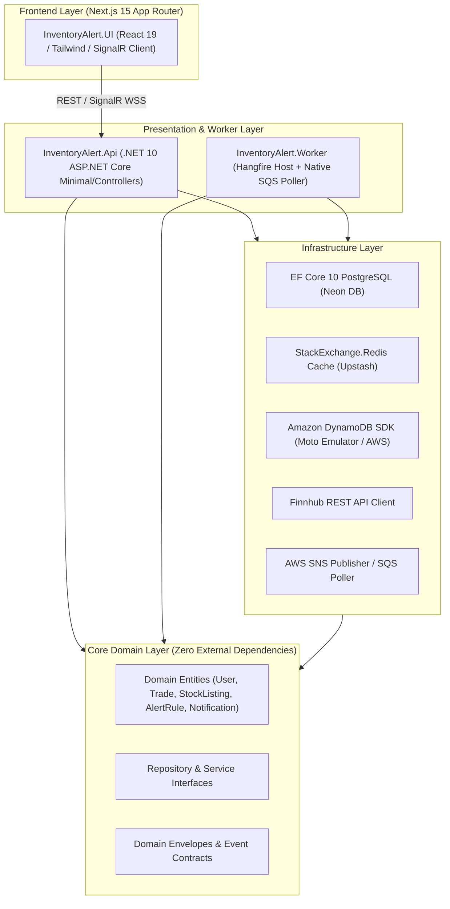
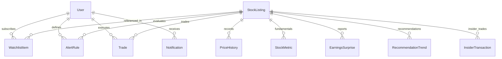
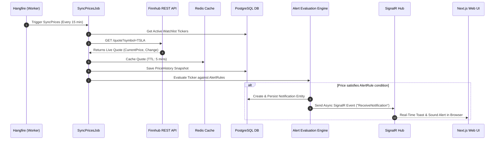
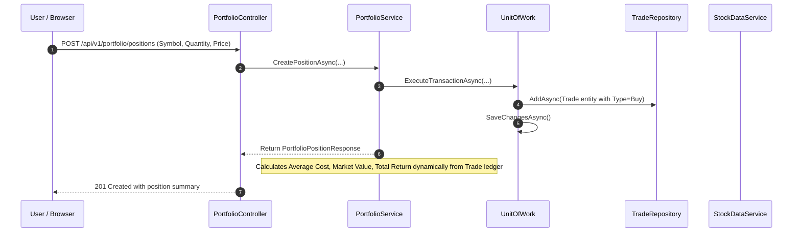
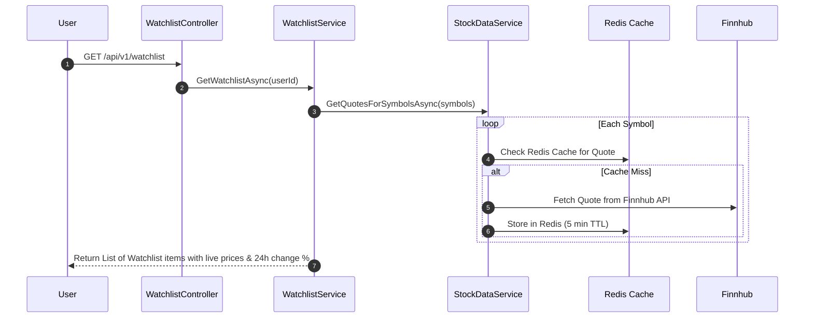
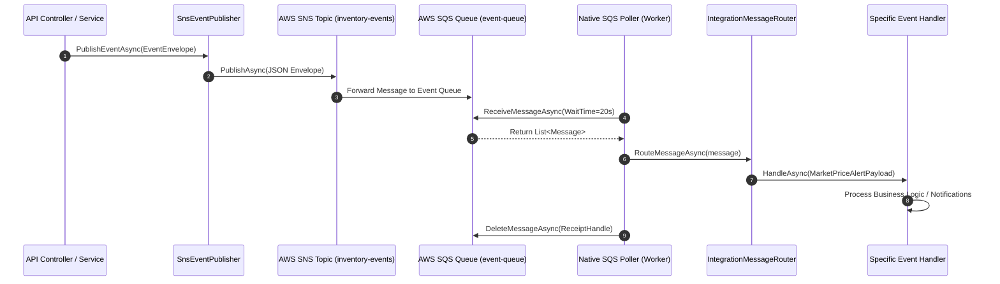
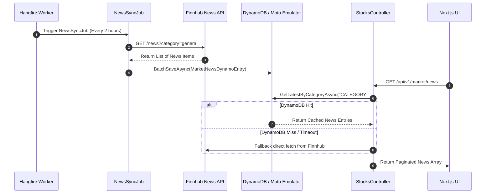

# 📑 Feature & Flow Master Documentation Plan — InventoryAlert

> **Document Status**: Draft Plan for Approval  
> **Target Version**: 2.5  
> **Last Updated**: August 13, 2026  
> **Scope**: End-to-End System Features, Architectural Flows, Domain Models, API Catalog, Background Jobs, UI Architecture, and Cloud Infrastructure.

---

## 📑 Table of Contents

1. [Architectural Overview & DDD Layer Topology](#1-architectural-overview--ddd-layer-topology)
2. [Domain Data Models & Storage Architecture](#2-domain-data-models--storage-architecture)
3. [End-to-End System Feature Flows & Sequence Diagrams](#3-end-to-end-system-feature-flows--sequence-diagrams)
   - [Flow 1: Real-Time Stock Quote Sync & Alert Rule Evaluation](#flow-1-real-time-stock-quote-sync--alert-rule-evaluation)
   - [Flow 2: Portfolio Position & Immutable Trade Ledger Management](#flow-2-portfolio-position--immutable-trade-ledger-management)
   - [Flow 3: Watchlist Management & Multi-Symbol Monitoring](#flow-3-watchlist-management--multi-symbol-monitoring)
   - [Flow 4: Event-Driven SQS/SNS Messaging & Integration Routing](#flow-4-event-driven-sqssns-messaging--integration-routing)
   - [Flow 5: Market & Company News Crawling Pipeline (DynamoDB Read Models)](#flow-5-market--company-news-crawling-pipeline-dynamodb-read-models)
4. [API Endpoint Catalog & Controller Specification](#4-api-endpoint-catalog--controller-specification)
5. [Background Worker & Scheduled Job Registry](#5-background-worker--scheduled-job-registry)
6. [Frontend Next.js 15 UI Application Architecture](#6-frontend-nextjs-15-ui-application-architecture)
7. [Production Cloud Deployment & Observability Blueprint](#7-production-cloud-deployment--observability-blueprint)

---

## 🏛️ 1. Architectural Overview & DDD Layer Topology

The **InventoryAlert** solution follows ROBERT C. MARTIN Clean Architecture and Domain-Driven Design (DDD) principles. Dependencies strictly point inward toward the Core Domain.



### Clean Architecture Boundaries
- **`InventoryAlert.Domain`**: Pure C# classes (Entities, Value Objects, Domain Events, Repository Interfaces). No references to ASP.NET, EF Core, or AWS SDKs.
- **`InventoryAlert.Infrastructure`**: Implementation of repositories (EF Core PostgreSQL, DynamoDB SDK), external integrations (Finnhub API), Redis caching, and SNS/SQS event publishing.
- **`InventoryAlert.Api`**: Controllers, JWT Authentication, OpenAPI/Swagger & Scalar documentation, SignalR Notification Hub, CORS, and `/aws` proxy middleware.
- **`InventoryAlert.Worker`**: Hangfire background job host, SQS message poller, integration event router, and scheduled financial sync workers.

---

## 🗄️ 2. Domain Data Models & Storage Architecture

The system uses a hybrid persistence strategy: **PostgreSQL** for transactional relational data, **Redis** for sub-second quote caching, and **DynamoDB** (or Postgres JSONB) for unstructured news read models.



### Entity Inventory

| Entity Name | Primary Key | Storage Engine | Purpose |
| :--- | :--- | :--- | :--- |
| `User` | `Id` (Guid/String) | PostgreSQL | Authentication identity, email, password hash, role. |
| `StockListing` | `Id` (Int / Ticker) | PostgreSQL | Master ticker directory (Symbol, Name, Exchange, Industry, Logo). |
| `WatchlistItem` | `Id` (Guid) | PostgreSQL | Junction entity mapping `UserId` to `StockListing`. |
| `Trade` | `Id` (Guid) | PostgreSQL | Immutable ledger recording buys, sells, price, quantity, and notes. |
| `AlertRule` | `Id` (Guid) | PostgreSQL | Condition rules (Price Above/Below/Change %) per user and ticker. |
| `Notification` | `Id` (Guid) | PostgreSQL | Persisted alert events delivered to user UI via SignalR. |
| `PriceHistory` | `Id` (Guid) | PostgreSQL | Historical daily/intraday price snapshots. |
| `StockMetric` | `Id` (Guid) | PostgreSQL | Financial metrics (P/E, MarketCap, 52W High/Low, Beta). |
| `EarningsSurprise` | `Id` (Guid) | PostgreSQL | Quarterly EPS estimates vs actual surprises. |
| `RecommendationTrend` | `Id` (Guid) | PostgreSQL | Analyst buy/hold/sell trends per ticker. |
| `InsiderTransaction` | `Id` (Guid) | PostgreSQL | Insider buy/sell transaction records. |
| `CompanyNewsDynamoEntry` | `PK: SYMBOL#sym`, `SK: DATE#ts` | DynamoDB | High-volume company news articles read model. |
| `MarketNewsDynamoEntry` | `PK: CATEGORY#cat`, `SK: DATE#ts` | DynamoDB | General market news articles read model. |

---

## 🔄 3. End-to-End System Feature Flows & Sequence Diagrams

### Flow 1: Real-Time Stock Quote Sync & Alert Rule Evaluation



---

### Flow 2: Portfolio Position & Immutable Trade Ledger Management



---

### Flow 3: Watchlist Management & Multi-Symbol Monitoring



---

### Flow 4: Event-Driven SQS/SNS Messaging & Integration Routing



---

### Flow 5: Market & Company News Crawling Pipeline (DynamoDB Read Models)



---

## 🔌 4. API Endpoint Catalog & Controller Specification

### Authentication Controller (`/api/v1/auth`)
- `POST /api/v1/auth/login`: Authenticates user credentials and returns JWT Bearer token.
- `POST /api/v1/auth/register`: Registers a new user account with hashed password.

### Stocks & Intelligence Controller (`/api/v1/stocks`)
- `GET /api/v1/stocks/search?q={query}`: Search symbols/tickers across Finnhub index.
- `GET /api/v1/stocks/{symbol}/quote`: Returns live price, high, low, open, close, and change %.
- `GET /api/v1/stocks/{symbol}/profile`: Returns company profile, industry, country, and logo.
- `GET /api/v1/stocks/{symbol}/financials`: Returns fundamental metrics (P/E, Beta, 52W Range).
- `GET /api/v1/stocks/{symbol}/earnings`: Returns quarterly EPS history and surprise %.
- `GET /api/v1/stocks/{symbol}/recommendations`: Returns analyst buy/sell/hold trend metrics.
- `GET /api/v1/stocks/{symbol}/insiders`: Returns insider buy/sell transactions.
- `GET /api/v1/stocks/{symbol}/peers`: Returns industry peer symbols.
- `GET /api/v1/stocks/{symbol}/news`: Returns company-specific news articles.

### Portfolio Controller (`/api/v1/portfolio`)
- `GET /api/v1/portfolio/positions`: Returns paginated positions with average price, current price, total cost, market value, and total return.
- `POST /api/v1/portfolio/positions`: Records a new position (opens position via Trade entry).
- `POST /api/v1/portfolio/trades`: Records a buy/sell trade against an existing symbol.
- `GET /api/v1/portfolio/trades`: Returns complete immutable trade history ledger.

### Watchlist Controller (`/api/v1/watchlist`)
- `GET /api/v1/watchlist`: Returns all symbols subscribed by the current user.
- `POST /api/v1/watchlist`: Adds a new symbol to user's watchlist.
- `DELETE /api/v1/watchlist/{symbol}`: Removes a symbol from user's watchlist.

### Alert Rules Controller (`/api/v1/alert-rules`)
- `GET /api/v1/alert-rules`: Lists all active alert rules created by the user.
- `POST /api/v1/alert-rules`: Creates a new price condition alert rule.
- `PUT /api/v1/alert-rules/{id}`: Updates threshold price or condition of an alert rule.
- `PATCH /api/v1/alert-rules/{id}/toggle`: Toggles an alert rule on or off.
- `DELETE /api/v1/alert-rules/{id}`: Deletes an alert rule.

### Notifications Controller (`/api/v1/notifications`)
- `GET /api/v1/notifications`: Lists paginated notifications for the user.
- `GET /api/v1/notifications/unread-count`: Returns integer count of unread notifications.
- `PUT /api/v1/notifications/{id}/ack`: Acknowledges/marks a single notification as read.
- `PUT /api/v1/notifications/ack-all`: Marks all notifications as read.

### Market Controller (`/api/v1/market`)
- `GET /api/v1/market/news`: Returns general market news items (DynamoDB backed).
- `GET /api/v1/market/status`: Returns current exchange market status (Open/Closed).
- `GET /api/v1/market/holidays`: Returns upcoming market holiday calendar.

### Events & Diagnostic Controller (`/api/v1/events`)
- `POST /api/v1/events`: Publishes a custom event envelope to SNS (for testing/diagnostics).
- `GET /aws/*`: Reverse-proxies HTTP traffic to internal Moto emulator on port `5000` (for `dynamodb-admin` or AWS CLI).

---

## ⏱️ 5. Background Worker & Scheduled Job Registry

The **Worker Host** (`InventoryAlert.Worker`) manages recurring financial background tasks via Hangfire and native SQS queue polling:

| Job Name | CRON Schedule | Frequency | Purpose |
| :--- | :--- | :--- | :--- |
| **`SyncPricesJob`** | `*/15 * * * *` | Every 15 mins | Fetches live quotes for all watchlist tickers, caches in Redis, updates `PriceHistory`, and triggers alert rule evaluation. |
| **`SyncMetricsJob`** | `20 6 * * *` | Daily at 06:20 | Syncs fundamental financial metrics (P/E, Beta, MarketCap) for all active symbols. |
| **`SyncEarningsJob`** | `35 7 * * *` | Daily at 07:35 | Syncs earnings surprises and EPS quarterly history. |
| **`SyncRecommendationsJob`** | `55 1 * * 1` | Weekly (Monday 01:55) | Syncs analyst recommendation trends (Buy/Hold/Sell). |
| **`SyncInsidersJob`** | `50 8 * * *` | Daily at 08:50 | Syncs insider transactions for all active symbols. |
| **`NewsSyncJob`** | `5 */2 * * *` | Every 2 hours | Fetches general market news and company news from Finnhub and batch writes to DynamoDB. |
| **`CleanupPriceHistoryJob`** | `10 2 * * *` | Daily at 02:10 | Purges price history records older than configured retention period. |
| **`ProcessQueueJob`** | Continuous Poller | Native Loop | Native SQS long-poller (20s wait time) pulling messages from `event-queue` and routing via `IntegrationMessageRouter`. |
| **`KeepAliveJob`** | `*/10 * * * *` | Every 10 mins | Self-pings `http://127.0.0.1:8080/healthz` to keep Render single-container awake 24/7. |

---

## 🎨 6. Frontend Next.js 15 UI Application Architecture

The UI is built with **Next.js 15 (App Router)**, **React 19**, **Tailwind CSS**, and `@microsoft/signalr`.

```
src/ui/InventoryAlert.UI/src/app/
├── (auth)/             ← Auth pages (Login, Register)
├── portfolio/          ← Portfolio dashboard & trade modal
├── watchlist/          ← Symbol watchlist & price tracking
├── alerts/             ← Alert rules management page
├── notifications/      ← Notifications center page
├── market/             ← Market news & intelligence page
├── stocks/[symbol]/    ← Ticker detailed analytics (Quote, Fundamentals, News, Recommendations)
├── layout.tsx          ← Root layout with Navbar, Auth Provider & SignalR Listener
└── page.tsx            ← Executive Summary Dashboard
```

### Key UI Features
1. **Real-Time SignalR Notifications**: Listens on `/hubs/notifications` WebSocket endpoint. Plays audio chime and pops interactive toast when price thresholds trigger.
2. **Dynamic Portfolio Calculations**: Calculates Market Value, Cost Basis, and Total Return % live using current Redis/Finnhub prices.
3. **Responsive Dark-Mode Styling**: Glassmorphic UI with custom Tailwind gradients, animated badge indicators, and zero browser defaults.

---

## ☁️ 7. Production Cloud Deployment & Observability Blueprint

### $0/Month Cloud Platform Topology

```
Vercel (Free)      ──►  Next.js 15 UI (React 19)
Render (Free)      ──►  Single-Container .NET 10 API + Worker + Moto (IPv4)
Neon (Free)        ──►  PostgreSQL Managed DB (IPv4 Pooled)
Upstash (Free)     ──►  Redis Cache & SignalR Backplane (TLS)
```

### Port Allocation in Render Container
- **Port `8080`** (`0.0.0.0:8080`): ASP.NET Core API Host (Exposed to Render public internet).
- **Port `8081`** (`127.0.0.1:8081`): Worker Kestrel Host.
- **Port `5000`** (`127.0.0.1:5000`): Moto AWS Emulator (SQS/SNS/DynamoDB).

### Monitoring & Access URL Blueprint
- **API Swagger UI**: `https://inventorymanagementsystem-s55e.onrender.com/swagger/index.html`
- **Scalar API Reference**: `https://inventorymanagementsystem-s55e.onrender.com/scalar/v1`
- **Hangfire Job Dashboard**: `https://inventorymanagementsystem-s55e.onrender.com/hangfire`
- **DynamoDB Admin Web UI**: `DYNAMO_ENDPOINT=https://inventorymanagementsystem-s55e.onrender.com/aws npx dynamodb-admin` ➔ Open `http://localhost:8001`
- **Health Check**: `https://inventorymanagementsystem-s55e.onrender.com/healthz`
