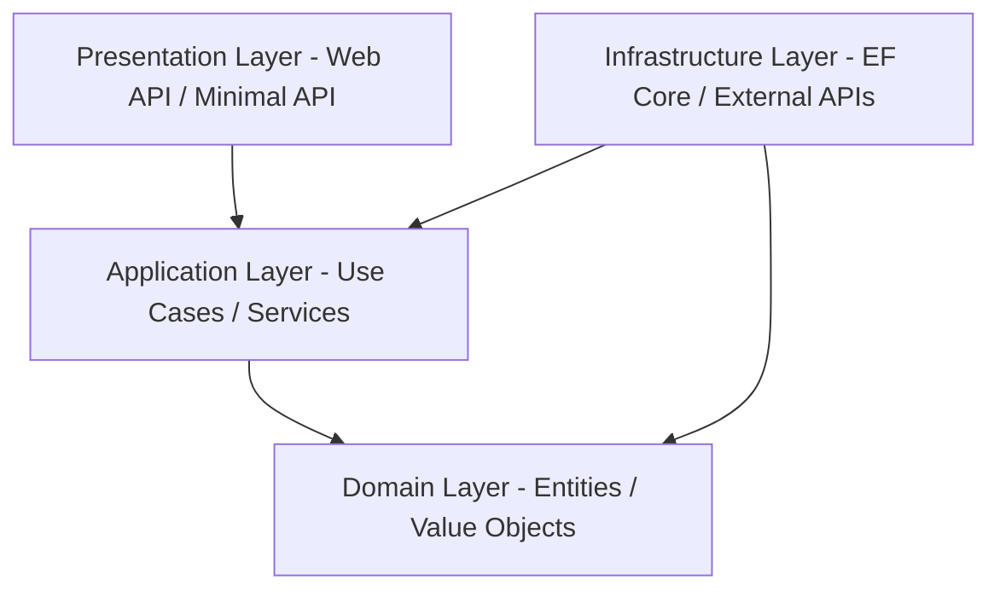

# 🚀 Enterprise .NET Web API & Clean Architecture Master Checklist

This document provides an authoritative, enterprise-grade architectural blueprint, coding standards guide, and code-review checklist for building and reviewing modern **ASP.NET Core Web APIs (.NET 8 / .NET 9)** using **Domain-Driven Design (DDD)** and **Clean Architecture**.

---

## 🏛️ 1. Clean Architecture & Layer Responsibilities

Dependencies strictly flow **inward** toward the core Domain layer. Frameworks, databases, and UI components are outer adapters.



### Layer Verification Checklist

#### 🟢 Domain Layer (Core Business Rules)
- [ ] **Zero Framework Dependencies**: Must NOT reference EF Core, ASP.NET Core, or external third-party SDKs.
- [ ] **Rich Entities**: Business logic encapsulates invariants within entities (avoid anemic domain models).
- [ ] **Value Objects**: Immutable types (e.g., `Money`, `Address`, `DateRange`) for structural equality.
- [ ] **Domain Events**: Events raised when core business state changes occur (e.g., `OrderPlacedEvent`).
- [ ] **Repository Interfaces**: Abstract data storage operations defined in Domain, implemented in Infrastructure.

#### 🔵 Application Layer (Use Cases & Workflow Orchestration)
- [ ] **Use Case Handlers**: CQRS pattern (Commands vs Queries) or Application Services mapping business tasks.
- [ ] **DTO Contracts**: Purpose-built Request/Response Data Transfer Objects to decouple API models from Domain entities.
- [ ] **Validation Rules**: Input validation decoupled from controllers (e.g., via `FluentValidation` or DataAnnotations).
- [ ] **Abstractions**: Interfaces for external services (`IEmailSender`, `IBlobStorage`, `IDateTimeProvider`).

#### 🟡 Infrastructure Layer (Technical Implementations)
- [ ] **Data Access**: `DbContext` implementations, EF Core Entity Configurations, and Migrations.
- [ ] **External Services**: Integrations with payment gateways, email servers, external REST APIs via `IHttpClientFactory`.
- [ ] **Persistence Repositories**: Implementations of Domain repository interfaces.
- [ ] **Background Workers**: `IHostedService` or Quartz/Hangfire background workers.

#### 🔴 Presentation Layer (API Controllers / Minimal APIs)
- [ ] **Thin Controllers**: Controllers only delegate requests to Application Services / Command Handlers.
- [ ] **HTTP Concerns Only**: Handles status codes, routing, content negotiation, model binding, and JWT auth.
- [ ] **Middleware Pipeline**: Configured in correct order (Cors -> Auth -> Custom Middleware -> Endpoints).

---

## 🔍 2. API Logic Audit, Duplicate Flows & Bloated Endpoint Checklist

Perform a thorough logic audit on all controller routes to detect duplicate flows, bloated payloads, or un-sanitized business calculations.

### A. Duplicate Flow & Overlap Audit
- [ ] **No Duplicate Query Logic**: Identify and consolidate identical LINQ query blocks duplicated across multiple controllers (e.g., duplicate date filtering or transaction categorization).
- [ ] **Single Source of Truth**: Route all financial/metric calculations through a unified Domain or Classification Engine (`AnalystClassifierEngine`) rather than re-implementing calculations inside individual controllers.
- [ ] **No Conflicting Route Signatures**: Audit route templates for overlapping paths (e.g. `/api/v1/analyst/dashboard` vs `/api/v1/bff/analyst-dashboard`). Deprecate or alias redundant routes.

### B. Bloated Endpoint Deconstruction ("API Too Big")
- [ ] **Single Responsibility Endpoints**: Each endpoint should serve a single clear purpose. Avoid "kitchen-sink" endpoints returning 15 unrelated data domains in one response unless strictly required by a specialized BFF route.
- [ ] **Response Payload Trimming**: Strip unneeded internal properties or raw entity graphs; return concise DTOs.
- [ ] **Bounded Collection Size**: Enforce default page limits (`pageSize = 20`, max 100) on list endpoints to prevent memory spikes.

### C. Logic Sanity & Arithmetic Invariants
- [ ] **Division by Zero Protection**: Check all percentage/rate calculations (`savingsRate`, `weightPercent`, `burdenRate`) for zero denominators (`totalIncome > 0 ? (value / totalIncome) * 100 : 0`).
- [ ] **Date Boundary Integrity**: Ensure `startDate` and `endDate` queries include full day boundaries (`2026-01-01T00:00:00Z` to `2026-12-31T23:59:59.999Z`) to avoid dropping end-of-month records.
- [ ] **Arithmetic Sign Invariants**: Enforce correct sign handling (`Debit` increases expenses, `Credit` increases income/refunds, `Balance = Credit - Debit`).
- [ ] **No Hidden Fallback Mocks**: Ensure endpoints query live database storage rather than falling back to hardcoded empty arrays (`new object[] { }`) or default 0s when data is present.

---

## ✂️ 3. Redundant Code & Dead Code Elimination (DRY & YAGNI)

- [ ] **No Dead / Commented-Out Code**: Remove all commented-out code blocks, unused imports (`using`), unused fields, and unreferenced methods.
- [ ] **No Duplicate Mapping Logic**: Use explicit mapping extension methods or AutoMapper/Mapster instead of manually copying properties in multiple places.
- [ ] **DRY LINQ Expressions**: Extract recurring query predicates into reusable extension methods or EF Core Specifications (e.g., `.WhereIsActive()`).
- [ ] **No Speculative Code (YAGNI)**: Do NOT write unused wrapper classes, premature generic abstractions, or features not currently required by business specifications.
- [ ] **Standard Library Preference**: Prefer built-in C# / .NET features (e.g. `System.Text.Json`, `Regex.IsMatch`, `LINQ`) over custom re-inventions.

---

## 📏 4. File & Method Boundary Standards (SRP)

Keep files and methods focused on a single responsibility to maintain high cohesion and readability.

### Size Boundary Rules
| Component | Maximum Limit | Recommended Target | Action If Exceeded |
| :--- | :--- | :--- | :--- |
| **Source File (`.cs`)** | **300 lines** | < 150 lines | Split into partial classes or separate sub-service classes |
| **Controller File** | **200 lines** | < 100 lines | Extract handlers into dedicated feature controllers or Mediator queries/commands |
| **Method / Function** | **30 lines** | < 15 lines | Refactor sub-steps into private helper methods |
| **Class Properties** | **20 properties** | < 10 properties | Group related fields into Value Objects or sub-DTOs |
| **Constructor Parameters** | **5 parameters** | < 3 parameters | Combine dependencies into cohesive services or record parameters |

- [ ] **Single Responsibility Principle (SRP)**: Each class/file must have only one reason to change.
- [ ] **Namespace / Folder Parity**: C# namespace hierarchy MUST match the physical folder directory structure (e.g. `FinanceDashboard.Infrastructure.Services` maps to `/Infrastructure/Services/`).

---

## ⚡ 5. Static Usage & State Safety Guidelines

In ASP.NET Core, web requests run concurrently across thread-pool threads. Mutable static state introduces severe concurrency bugs and cross-tenant data leaks.

- [ ] **NO Mutable Static Fields**: Never store request-specific, user-specific, or mutable data in `static` fields or properties.
- [ ] **Pure Static Utilities**: Static classes/methods MUST be pure functions with zero internal mutable state (e.g. string formatting, mathematical calculation, regex matching).
- [ ] **Thread-Safe Statics**: Immutable `static readonly` fields are permitted ONLY for global configuration defaults or compiled regexes (`RegexOptions.Compiled`).
- [ ] **Dependency Injection Lifetime Safety**:
  - `Transient`: Created every time requested. Use for lightweight, stateless services.
  - `Scoped`: Created once per HTTP request. Use for `DbContext`, Repositories, and Request Services.
  - `Singleton`: Created once for application lifetime. MUST BE THREAD-SAFE. Never inject a `Scoped` dependency (e.g. `DbContext`) into a `Singleton` service (Captive Dependency bug).

---

## 🏷️ 6. Deep-Dive Naming Conventions

### Detailed Naming Rules
| Category | Formatting | Rule / Standard | Example |
| :--- | :--- | :--- | :--- |
| **Solutions** | PascalCase | `<Company>.<Product>` | `FinanceDashboard.sln` |
| **Projects** | PascalCase | `<Company>.<Product>.<Layer>` | `FinanceDashboard.Infrastructure` |
| **Classes / Structs** | PascalCase | Noun phrase | `TransactionClassifierPolicy` |
| **Interfaces** | Prefix `I` + PascalCase | Adjective or Noun phrase | `IBffApplicationService` |
| **Generic Parameters** | Prefix `T` + PascalCase | Descriptive type constraint | `where TEntity : class` |
| **Async Methods** | PascalCase + `Async` | Verb phrase ending with `Async` | `GetDashboardMetricsAsync()` |
| **Booleans** | PascalCase | Prefix `Is`, `Has`, `Can`, `Should` | `IsModified`, `HasPermission` |
| **Private Fields** | `_` + camelCase | Noun phrase with underscore | `_dbContext`, `_logger` |
| **Constants** | PascalCase | Explicit value holder | `DefaultCurrency = "VND"` |
| **Enums** | PascalCase | Singular (Plural for `[Flags]`) | `TransactionType`, `UserRoles` |
| **JSON Properties** | Configured Policy | `snake_case` or `camelCase` via `JsonPropertyName` | `"transaction_code"`, `"debit"` |

---

## 🌐 7. RESTful API Design & Response Envelope Standards

### HTTP Verbs & Semantics
- [ ] `GET`: Read operations. Must be safe and idempotent. Returns `200 OK` or `404 Not Found`.
- [ ] `POST`: Create resource or execute action. Returns `201 Created` with `Location` header or `200 OK`.
- [ ] `PUT`: Full replacement of resource. Idempotent. Returns `200 OK` or `204 No Content`.
- [ ] `PATCH`: Partial update of resource. Returns `200 OK`.
- [ ] `DELETE`: Remove resource. Idempotent. Returns `200 OK` or `204 No Content`.

### Route Design Rules
- [ ] Lowercase with hyphens (kebab-case) or standard lowercase routes: `api/v1/user-profiles`.
- [ ] Plural nouns for resource collections (`api/v1/orders`, `api/v1/transactions`).
- [ ] Nested paths for sub-resources (`api/v1/users/{userId}/orders`).

### Uniform Response Envelope
Standardize API payloads across success and failure cases:

```json
{
  "success": true,
  "data": { ... },
  "message": "Operation completed successfully"
}
```

Standardized Error Format (RFC 7807 ProblemDetails compliant):
```json
{
  "success": false,
  "statusCode": 400,
  "error": "ValidationFailed",
  "message": "One or more validation errors occurred.",
  "errors": {
    "email": ["Email address is invalid."]
  }
}
```

---

## 🗄️ 8. Data Access & Entity Framework Core Standards

- [ ] **Explicit Table & Column Configurations**:
  - Implement `IEntityTypeConfiguration<T>` for clean mappings.
  - Avoid inline magic strings in `DbContext`.
- [ ] **Monetary & Numeric Precision**:
  - Always specify SQL column type for decimals: `.HasColumnType("numeric(18,2)")` or `.HasColumnType("decimal(18,4)")`.
- [ ] **Read Query Optimization**:
  - Use `.AsNoTracking()` for read-only queries.
  - Project DTOs directly using `.Select()` to minimize data transport.
- [ ] **Index Strategy**:
  - Index foreign keys and frequently queried filter/sort columns.
  - Enforce unique composite constraints for deduplication (`HasIndex(...).IsUnique()`).
- [ ] **UTC Date Consistency**:
  - Store all DateTime properties as UTC (`DateTimeKind.Utc`).
  - Convert incoming client dates to UTC before saving; format outgoing dates as standard ISO 8601 UTC strings (`yyyy-MM-ddTHH:mm:ss.fffZ`).
- [ ] **Soft Delete Support**:
  - Apply EF Core Global Query Filters for `IsDeleted` status where soft delete is required.

---

## 🚩 9. Code Smell & Anti-Pattern Red Flag Checklist

Be on high alert during code reviews for the following anti-patterns:

| Code Smell | Description | Fix |
| :--- | :--- | :--- |
| **God Controller** | Controller > 200 lines or handling business logic | Move business logic to Application layer use-case handlers |
| **Sync over Async** | Calling `.Result`, `.Wait()`, or `.GetAwaiter().GetResult()` | Use `await` throughout the entire call stack |
| **Async Void** | `async void` methods (except event handlers) | Change signature to `async Task` |
| **Magic Strings** | Hardcoded category names or SQL types in multiple files | Move to `const`, `enum`, or strongly typed configuration |
| **Swallowed Exceptions**| `catch (Exception ex) { }` with no logging or rethrow | Log exception structuredly and handle or rethrow |
| **Captive Dependency**| Injecting `Scoped` dependency into `Singleton` service | Align DI lifetimes or inject `IServiceScopeFactory` |
| **Anemic Model** | Domain entity with public getters/setters and zero logic | Encapsulate mutations inside entity methods |
| **Leaky Abstraction**| Controller returning EF Core entity directly | Map entity to DTO before returning response |

---

## 🔒 10. Security, Authorization & Infrastructure

- [ ] **JWT Authentication**: Validate Issuer, Audience, Signing Key, and Expiration.
- [ ] **Role & Policy Authorization**: Enforce `[Authorize]` attributes and policy checks (`[Authorize(Policy = "AdminOnly")]`).
- [ ] **CORS Configuration**: Restrict allowed origins in production (no `.AllowAnyOrigin()` with credentials).
- [ ] **SQL Injection Prevention**: Parameterize EF Core LINQ queries.
- [ ] **Sensitive Data Protection**: Encrypt credentials using .NET Data Protection (`IDataProtectionProvider`).

---

## ⚡ 11. Logging, Observability & Container Verification

- [ ] **Structured Logging**: Use Serilog/OpenTelemetry with semantic placeholder parameters.
- [ ] **Global Exception Middleware**: Catch uncaught errors globally and emit RFC 7807 JSON errors.
- [ ] **Health Checks**: Configure `/healthz`, `/health/live`, `/health/ready`.
- [ ] **Clean Build**: `dotnet build` succeeds with **0 Errors**.
- [ ] **Multi-Stage Dockerfile**: SDK build stage separated from lightweight ASP.NET runtime image.

---

## 🤖 12. How to Use This Checklist & AI Review Prompts

### Recommended Code Review Strategy: **Feature-by-Feature (Component-by-Component)**

> [!TIP]
> **Do NOT review the entire solution in a single massive pass.** Reviewing 50+ files at once leads to review fatigue and misses critical edge cases.
> **Best Practice**: Review **one vertical slice / feature at a time** (e.g., `Analyst Engine Feature`, `Auth Flow`, `Transaction Management`).

---

### Reusable AI Code Review Prompts

Copy and paste these pre-formatted prompts into your AI coding assistant (or code-review tool) along with your target code files.

#### 📋 Prompt A: Single Feature / Controller Deep-Dive Review
```markdown
Please perform a rigorous code review of the following C# files against our .NET Web API Architecture Checklist:

Target Files:
- [Insert Controller File Path, e.g., AnalystController.cs]
- [Insert Service File Path, e.g., AnalystClassifierEngine.cs]

Audit Criteria:
1. Clean Architecture: Are HTTP concerns separated from business logic? Is the controller thin (< 200 lines)?
2. Duplicate Logic: Is query logic or calculation logic duplicated anywhere?
3. File & Method Boundaries: Are source files under 300 lines and methods under 30 lines?
4. Static Safety: Are there any mutable static fields or unsafe static usages?
5. Naming & Formatting: Do interface names start with 'I'? Do async methods end with 'Async'? Are booleans named with 'Is'/'Has'?
6. Math & Boundary Sanity: Is division by zero guarded? Are dates parsed in UTC ISO format?

Provide your findings formatted as:
- ❌ Critical Issues (Concurrency, logic errors, math bugs)
- ⚠️ Code Smells & Violations (File size, naming, static usage)
- 💡 Recommended Refactorings (Concrete code diff snippets)
```

#### 📋 Prompt B: Full Pull Request / Layer Audit
```markdown
Please conduct an architectural code review of this Pull Request against our enterprise .NET standards:

PR Description / Files Changed:
[Paste git diff or list of files changed]

Verify:
- Domain Isolation: Does the Domain layer remain free of EF Core / Web framework dependencies?
- EF Core Optimization: Are read queries using .AsNoTracking()? Are decimal types mapped with explicit numeric precision?
- API Envelope: Do all responses return the standard { success, data, message } envelope?
- Dead Code: Is there any commented-out code, unused imports, or unused methods that must be deleted?

List all violations with file line numbers and recommended fixes.
```
