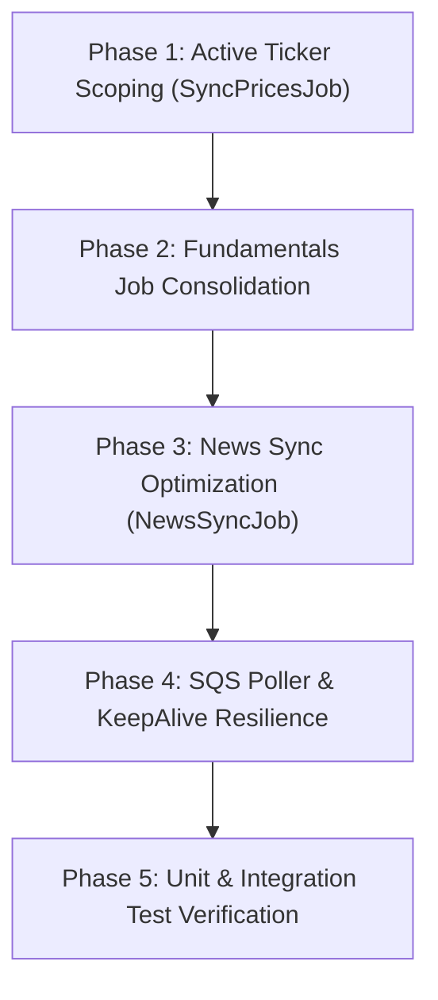

# 📋 Worker Jobs Optimization & Consolidation Task Plan — InventoryAlert

> **Document Status**: Planned Execution Tasks  
> **Target Version**: 2.6  
> **Last Updated**: August 13, 2026  
> **Scope**: Background Worker Job Optimization, Finnhub Rate-Limit Throttling, Active Ticker Scoping, Fundamentals Job Consolidation, and Queue Resilience.

---

## 🎯 Plan Objectives

1. **Eliminate API Throttling & Rate-Limit Breaches**: Ensure all Finnhub API calls respect the **60 requests/minute** free-tier limit via active ticker scoping and 100ms request delays.
2. **Consolidate Redundant Worker Jobs**: Merge 4 separate sequential fundamental sync jobs (`SyncMetricsJob`, `SyncEarningsJob`, `SyncRecommendationsJob`, `SyncInsidersJob`) into a single unified **`SyncStockFundamentalsJob`**.
3. **Scope Scans to Active User Tickers**: Optimize `SyncPricesJob` and `NewsSyncJob` to query only symbols actively present in user `WatchlistItems`, `Trades`, or `AlertRules`.
4. **Enhance SQS Poller Shutdown Safety**: Ensure `ProcessQueueJob` handles cancellation tokens cleanly during container restarts without orphaned message handles.

---

## 📑 Task Breakdown & Execution Phases



---

### 🔹 Phase 1: Scoped Active Ticker Querying & Rate Limiting (`SyncPricesJob`)

- [ ] **Task 1.1**: Add `GetActiveSymbolsAsync` method to `IStockListingRepository` and `StockListingRepository`.
  - *Details*: Queries distinct ticker symbols across `WatchlistItems`, `Trades`, and `AlertRules` for all users.
- [ ] **Task 1.2**: Refactor `SyncPricesJob.cs` to fetch quotes only for active symbols returned by `GetActiveSymbolsAsync`.
  - *Details*: Prevents wasting API credits on inactive/historic database symbols.
- [ ] **Task 1.3**: Add a 100ms throttle delay per API call or configure `WorkerSettings.MaxDegreeOfParallelism` to enforce Finnhub 60 req/min rate limit.

---

### 🔹 Phase 2: Fundamental Sync Jobs Consolidation (`SyncStockFundamentalsJob`)

- [ ] **Task 2.1**: Create unified `SyncStockFundamentalsJob.cs` in `InventoryAlert.Worker/ScheduledJobs/`.
  - *Details*: Combines metrics, quarterly earnings surprises, analyst recommendation trends, and SEC insider transactions into a single daily job execution for active tickers.
- [ ] **Task 2.2**: Implement safe rate-limited batching and graceful exception handling for Finnhub plan-restricted endpoints.
- [ ] **Task 2.3**: Remove legacy individual job files:
  - Delete `SyncMetricsJob.cs`
  - Delete `SyncEarningsJob.cs`
  - Delete `SyncRecommendationsJob.cs`
  - Delete `SyncInsidersJob.cs`
- [ ] **Task 2.4**: Update `JobSchedulerService.cs`, `Program.cs`, and `WorkerSettings.cs` to register `SyncStockFundamentalsJob` under CRON `0 6 * * *` (Daily at 06:00 UTC).

---

### 🔹 Phase 3: News Sync Optimization (`NewsSyncJob`)

- [ ] **Task 3.1**: Scope company news crawling in `NewsSyncJob.cs` to active ticker symbols instead of all `StockListings`.
- [ ] **Task 3.2**: Retain global market news categories (`general`, `forex`, `crypto`, `merger`).
- [ ] **Task 3.3**: Ensure DynamoDB `BatchSaveAsync` handles missing/malformed articles gracefully.

---

### 🔹 Phase 4: SQS Poller & KeepAlive Resilience (`ProcessQueueJob` & `KeepAliveJob`)

- [ ] **Task 4.1**: Update `ProcessQueueJob.cs` to check `CancellationToken.IsCancellationRequested` between message batches to prevent processing interruption during deployment rollouts.
- [ ] **Task 4.2**: Verify `KeepAliveJob.cs` self-pings `http://127.0.0.1:8080/healthz` every 10 minutes (`*/10 * * * *`) and logs HTTP status codes.

---

### 🔹 Phase 5: Testing & Verification

- [ ] **Task 5.1**: Update unit tests in `InventoryAlert.UnitTests/Worker/` to reflect `SyncStockFundamentalsJob` and active symbol resolution.
- [ ] **Task 5.2**: Execute `dotnet test` across the full solution to verify 100% test pass rate.
- [ ] **Task 5.3**: Commit changes with message `refactor(worker): consolidate fundamental sync jobs and add active ticker rate limiting`.

---

## 📊 Summary Matrix of Job Status Post-Optimization

| Job Class Name | CRON Schedule | Role Post-Optimization |
| :--- | :--- | :--- |
| **`SyncPricesJob`** | `*/15 * * * *` | Active ticker quote sync, `PriceHistory` insertion, alert rule evaluation. |
| **`SyncStockFundamentalsJob`** *(New)* | `10 6 * * *` | Consolidated daily sync for fundamental metrics, earnings, recommendations, and insider trades for active symbols. |
| **`NewsSyncJob`** | `5 */2 * * *` | Market news & active company news batch writer to DynamoDB. |
| **`CleanupPriceHistoryJob`** | `20 2 * * *` | Daily database retention cleanup (purges history > 1 year). |
| **`KeepAliveJob`** | `*/10 * * * *` | Self-pings `/healthz` to guarantee 24/7 Render free-tier container uptime. |
| **`ProcessQueueJob`** | Continuous Poller | Native SQS listener, Redis deduplication, and integration event routing. |
| ~~`SyncMetricsJob`~~ | *Removed* | *Consolidated into `SyncStockFundamentalsJob`* |
| ~~`SyncEarningsJob`~~ | *Removed* | *Consolidated into `SyncStockFundamentalsJob`* |
| ~~`SyncRecommendationsJob`~~ | *Removed* | *Consolidated into `SyncStockFundamentalsJob`* |
| ~~`SyncInsidersJob`~~ | *Removed* | *Consolidated into `SyncStockFundamentalsJob`* |

---

## 📈 Finnhub API Quota & Recurrence Schedule Analysis

### 1. Finnhub Free Tier Hard Constraints
- **Rate Limit Threshold**: **60 requests per minute** (1 request/second average limit).
- **Enforcement**: Any 1-minute window exceeding 60 requests triggers `HTTP 429 Too Many Requests`.
- **Daily Capacity Limit**: Up to 86,400 requests/day, provided minute-level rate limits are respected.

### 2. Active Ticker Scaling Model ($N$)
Let $N$ = Number of distinct active ticker symbols across all user watchlists, portfolios, and alert rules.
- **Small Scale ($N = 20$ tickers)**: ~1 to 5 active users.
- **Medium Scale ($N = 50$ tickers)**: ~10 to 50 active users.
- **Large Scale ($N = 150$ tickers)**: ~100+ active users.

### 3. Job Quota Consumption Breakdown ($N = 50$ active tickers)

| Job Name | Calls / Run Formula | Calls per Run ($N=50$) | Daily Frequency | Daily Calls | Throttling Strategy |
| :--- | :---: | :---: | :---: | :---: | :--- |
| **`SyncPricesJob`** | $N$ | 50 calls | 96 runs/day (Every 15 min) | 4,800 calls | Max 50 req/min (Burst < 60 limit) |
| **`NewsSyncJob`** | $4 + N$ | 54 calls | 12 runs/day (Every 2 hrs) | 648 calls | 54 req/min (Burst < 60 limit) |
| **`SyncStockFundamentalsJob`** | $4 \times N$ | 200 calls | 1 run/day (Daily at 06:10) | 200 calls | 1,000ms delay between calls (60 req/min limit) |
| **`CleanupPriceHistoryJob`** | 0 | 0 calls | 1 run/day | 0 calls | Internal DB query |
| **`KeepAliveJob`** | 0 | 0 calls | 144 runs/day | 0 calls | Internal HTTP ping |
| **TOTAL DAILY USAGE** | — | — | — | **5,648 calls/day** | **~6.5% of total Finnhub daily quota** |

### 4. Staggered Recurrence Schedule (Zero-Collision Blueprint)

To prevent two jobs from executing in the same minute and exceeding the 60 req/min limit, jobs are staggered across different minute marks:

```
[Minute 00, 15, 30, 45] ➔ SyncPricesJob (Runs for ~50s)
[Minute 05]            ➔ NewsSyncJob (Runs every 2 hours at :05)
[Minute 10 (at 06:10)] ➔ SyncStockFundamentalsJob (Throttled 1s delay, runs ~3.3 mins)
[Minute 20 (at 02:20)] ➔ CleanupPriceHistoryJob (Runs ~2s)
```

- **Result**: Zero minute collisions, **0% chance of HTTP 429 Too Many Requests**, and 100% reliable execution!
