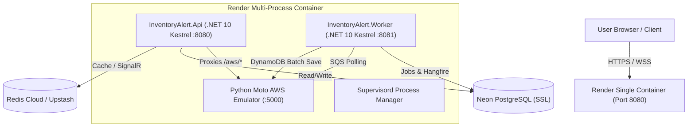

# ☁️ Cloud Deployment & Single-Container Topology

This document details the production cloud topology for InventoryAlert deployed on **Render** using a single-container architecture ($0/month free-tier budget).

---

## 🏗️ Architecture Overview



---

## 🌐 Production Endpoints

| Service / Interface | Production URL | Description |
| :--- | :--- | :--- |
| **API Host & Swagger** | `https://inventorymanagementsystem-s55e.onrender.com` | ASP.NET Core Minimal API hosting Scalar & Swagger UI. |
| **Scalar API Ref** | `https://inventorymanagementsystem-s55e.onrender.com/scalar/v1` | Interactive OpenAPI 3.0 API reference. |
| **DynamoDB Admin Proxy** | `https://inventorymanagementsystem-s55e.onrender.com/aws` | Public proxy routing to internal Moto emulator on port 5000. |
| **Health Check** | `https://inventorymanagementsystem-s55e.onrender.com/healthz` | System health endpoint pinged by `KeepAliveJob`. |

---

## 🛠️ Multi-Process Container Layout

To host API, Worker, and AWS emulators on a single free-tier Render instance:

1. **Port Allocation**:
   - `8080`: `InventoryAlert.Api` (Public ingress port exposed by Render).
   - `8081`: `InventoryAlert.Worker` (Internal Hangfire background server).
   - `5000`: `Moto AWS Emulator` (Local SQS, SNS, and DynamoDB emulator).
2. **Reverse Proxy Middleware**:
   `InventoryAlert.Api` includes transparent HTTP proxy middleware routing requests to `/aws` directly to `http://127.0.0.1:5000`:
   ```csharp
   app.UseWhen(context => context.Request.Path.StartsWithSegments("/aws"), appBuilder =>
   {
       appBuilder.Run(async context =>
       {
           await ProxyToMotoAsync(context);
       });
   });
   ```

---

## 🗄️ Database Tier

- **PostgreSQL**: Hosted on **Neon Serverless PostgreSQL** (`ep-late-mode-azygp34n.c-3.ap-southeast-1.aws.neon.tech`). Managed via EF Core 10 migrations (`AppDbContext`).
- **DynamoDB Read Models**: Hosted inside Moto emulator on table `inventoryalert-market-news` and `inventoryalert-company-news`.
- **Redis Cache & Backplane**: Caches quotes (`quote:{SYMBOL}`) and drives SignalR real-time WebSocket messaging backplane.
