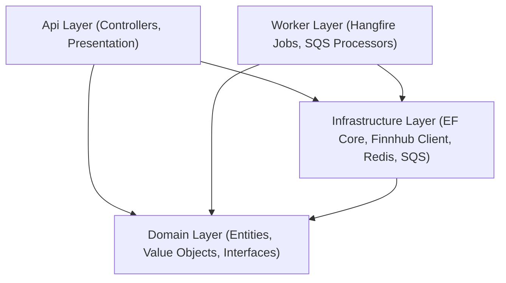

# 📁 Project Directory Tree & Clean Architecture Layout

This document outlines the codebase layout of the InventoryAlert solution, organized strictly according to **Domain-Driven Design (DDD)** and **Clean Architecture**.

---

## 🏛️ Monorepo Root Layout

```
InventoryManagementSystem/
├── .agents/                                ← AI Customization Root (skills, workflows, BM25 scripts)
│   ├── GEMINI.md                           ← Master AI cold-start briefing
│   ├── rules/                              ← Project coding guidelines
│   ├── skills/                             ← Deep domain skills (DDD, EF Core, Finnhub, testing)
│   └── scripts/core/                       ← BM25 indexer & search engine
├── src/
│   ├── InventoryAlert.Api/                 ← Web API Layer (Controllers, Middlewares, Program.cs)
│   ├── InventoryAlert.Domain/              ← Core Domain Layer (Entities, DTOs, Interfaces)
│   ├── InventoryAlert.Infrastructure/      ← Data & External Layer (EF Core, Finnhub, SQS, Redis)
│   ├── InventoryAlert.Worker/              ← Background Processing Layer (Hangfire, SQS Poller)
│   ├── ui/
│   │   ├── InventoryAlert.UI/              ← Next.js 15 App Router Frontend
│   │   └── InventoryAlert.Wiki/            ← Docusaurus Documentation Wiki (this documentation)
│   └── test/
│       ├── InventoryAlert.UnitTests/       ← xUnit Unit Tests (102 tests)
│       ├── InventoryAlert.IntegrationTests/
│       └── InventoryAlert.E2ETests/
├── Dockerfile                              ← Production Multi-stage Build Dockerfile
├── docker-compose.yml                      ← Local Infrastructure Stack (PostgreSQL, Redis, Moto)
└── InventoryManagementSystem.sln           ← .NET 10 Solution File
```

---

## 🧩 DDD Layer Boundaries



1. **Domain Layer (`InventoryAlert.Domain`)**:
   - Zero dependencies on external libraries or HTTP components.
   - Contains PostgreSQL entities (`User`, `StockListing`, `WatchlistItem`, `AlertRule`, `Trade`, `Notification`).
   - Contains DynamoDB read-model entries (`MarketNewsDynamoEntry`, `CompanyNewsDynamoEntry`).
   - Defines repository interfaces (`IUnitOfWork`, `IStockListingRepository`, `ITradeRepository`).

2. **Infrastructure Layer (`InventoryAlert.Infrastructure`)**:
   - Implements data access via EF Core 10 (`AppDbContext`).
   - Implements `IFinnhubClient` REST integration with automatic retry logic.
   - Manages AWS SNS/SQS messaging and Redis caching.

3. **API & Worker Hosts**:
   - **`InventoryAlert.Api`**: Exposes REST API controllers, JWT authentication, and SignalR hub (`/hubs/notifications`).
   - **`InventoryAlert.Worker`**: Executes background Hangfire CRON schedules and continuous SQS event polling.
