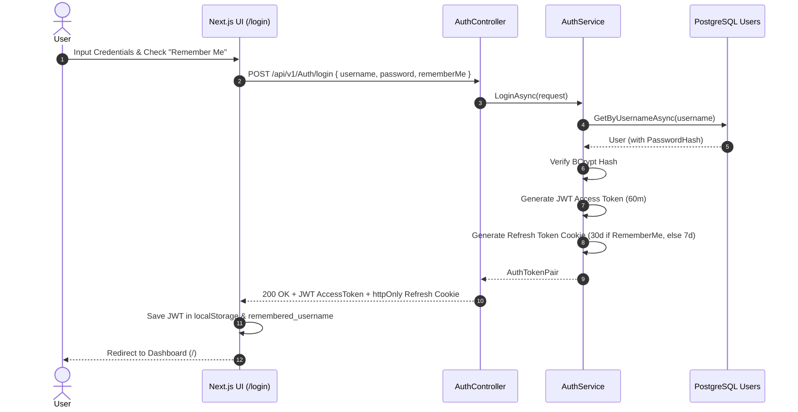
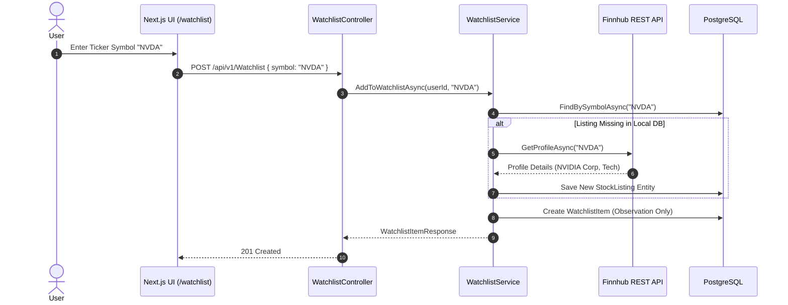
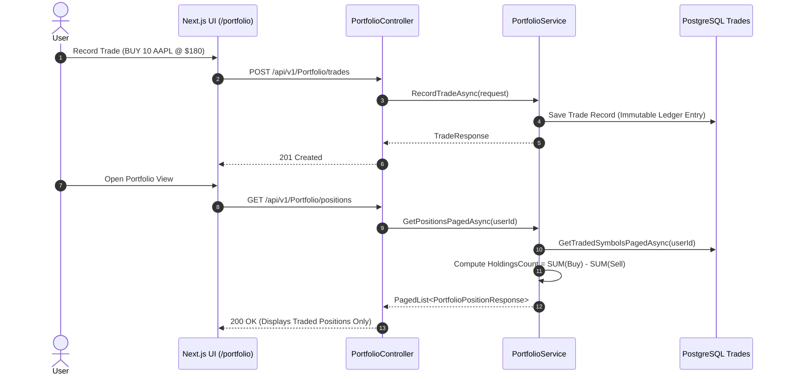
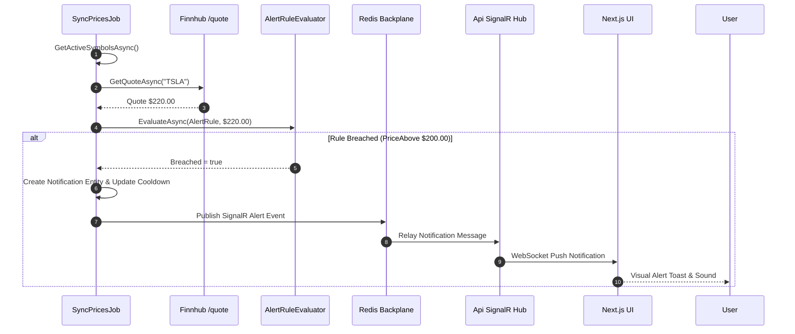
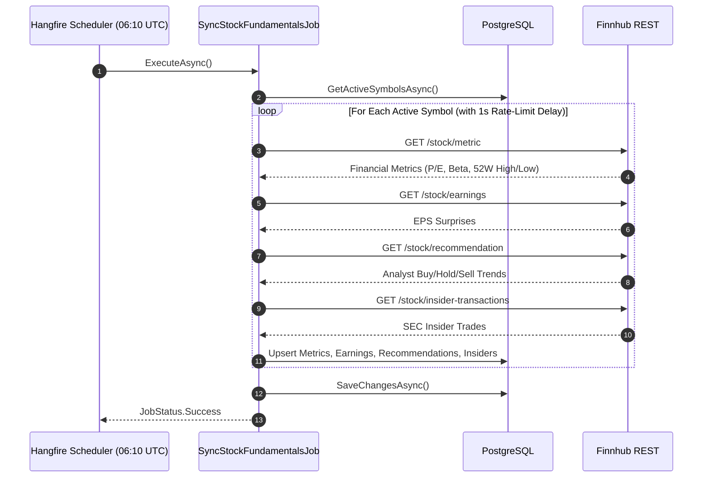

# 🗺️ Master Feature & Sequence Flow Blueprint

This master plan documents the 5 core end-to-end operational sequence flows of InventoryAlert.

---

## 📌 1. Flow 1: User Authentication & Persistent Login (Remember Me)

---

## 📌 2. Flow 2: Watchlist Management & Finnhub Symbol Auto-Discovery

---

## 📌 3. Flow 3: Portfolio Ledger & Trade-Driven Position Derivation

> **Architectural Rule**: Portfolio positions are derived strictly from actual trades in `Trades`. Watchlist items are observation-only.

---

## 📌 4. Flow 4: Real-time Alert Rule Evaluation & SignalR Push

---

## 📌 5. Flow 5: Consolidated Daily Fundamentals Sync (`SyncStockFundamentalsJob`)

