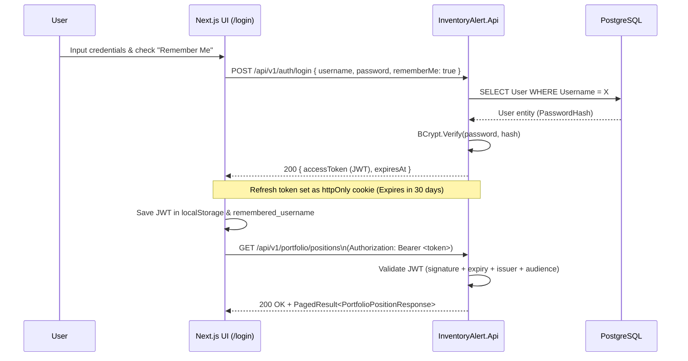
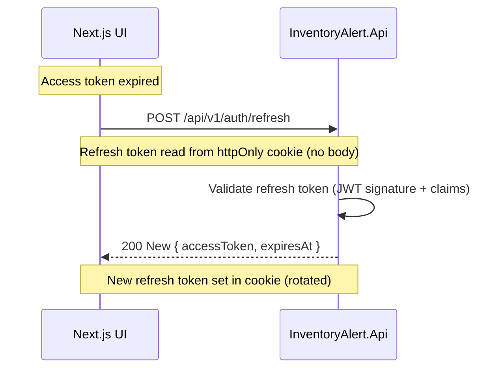
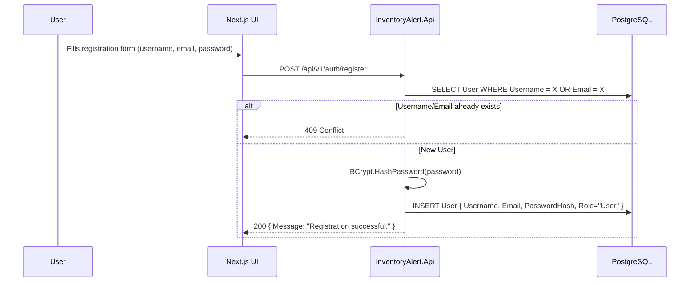

# 🔐 User Authentication & Remember Me Flow

How users register, log in with persistent "Remember Me" sessions, refresh tokens, and access protected resources.

## JWT Token Lifecycle & Remember Me

Access token TTL defaults to **60 minutes** (config: `Jwt:ExpiryMinutes`). Refresh token TTL defaults to **7 days** (config: `Jwt:RefreshExpiryDays`).

When a user enables **Remember Me** during login:
- The backend extends the refresh token cookie lifespan to **30 days**.
- The frontend stores `remembered_username` in `localStorage` to automatically pre-fill returning user credentials.
- Refresh tokens are stored as `httpOnly` cookies (`Secure` on HTTPS, `SameSite=None` for HTTPS/localhost).



---

## Token Refresh Flow



---

## Registration Flow



---

## JWT Token Claims

```json
{
  "sub": "00000000-0000-0000-0000-000000000001",
  "http://schemas.xmlsoap.org/ws/2005/05/identity/claims/name": "admin",
  "http://schemas.microsoft.com/ws/2008/06/identity/claims/role": "Admin",
  "jti": "unique-token-id",
  "iss": "InventoryAlert.Api",
  "aud": "InventoryAlert.UI",
  "exp": 1713000000
}
```

| Claim | Purpose |
|---|---|
| `sub` | User ID (Guid) — used by all services to scope data access |
| `name` | Username — displayed in UI |
| `role` | `User` or `Admin` — controls endpoint authorization |
| `exp` | Token expiry — controlled by `Jwt:ExpiryMinutes` (default 60 minutes) |
| `iss` / `aud` | Validated on every request when configured (`Jwt:Issuer`, `Jwt:Audience`) |

---

## Authorization Levels

| Endpoint | Required |
|---|---|
| `POST /api/v1/auth/login`, `POST /api/v1/auth/register`, `POST /api/v1/auth/refresh` | `[Public]` — no token needed |
| All other endpoints | `[Authorize]` — valid JWT required |
| `POST /api/v1/stocks/sync`, `GET/POST /api/v1/events/*` | `[Authorize(Roles = "Admin")]` |
| `GET /api/v1/market/status` | `[AllowAnonymous]` — explicitly public |

---

## Security Considerations

- Passwords are hashed with **BCrypt**.
- Access token delivered in JSON body; **refresh token in `httpOnly` cookie** — not accessible to JavaScript.
- Refresh tokens are **rotated** on each refresh call (revocation/deny-list can be added if strict single-use is required).
- All sensitive config (`Jwt:Key`, `Database:ConnectionString`, `Finnhub:ApiKey`) lives in `appsettings.*.json` which is **gitignored**. Only `appsettings.Example.json` is committed.
